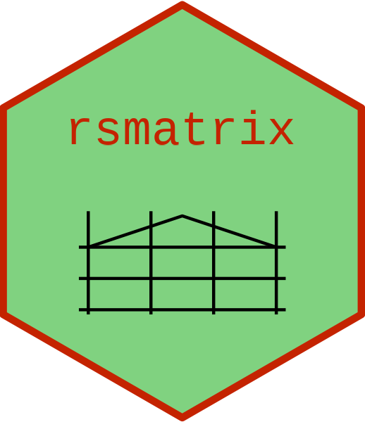

<!-- README.md is generated from README.Rmd. Please edit that file. -->

```{r setup, include=FALSE}
knitr::opts_chunk$set(echo = TRUE)
```

# Matrices for repeat-sales price indexes <a href="https://marberts.github.io/rsmatrix/"></a>

<!-- badges: start -->
[](https://cran.r-project.org/package=rsmatrix)
[](https://marberts.r-universe.dev)
[](https://github.com/marberts/rsmatrix/actions)
[](https://codecov.io/gh/marberts/rsmatrix)
[](https://zenodo.org/doi/10.5281/zenodo.10110159)
<!-- badges: start -->

Calculate the matrices in Shiller (1991) that serve as the foundation for many repeat-sales price indexes.

## Installation

Get the stable release from CRAN.

```{r, eval=FALSE}
install.package("rsmatrix")
```

Install the development version from R-Universe

```{r, eval=FALSE}
install.packages("rsmatrix", repos = c("https://marberts.r-universe.dev", "https://cloud.r-project.org"))
```

or directly from GitHub.

```{r, eval=FALSE}
pak::pak("marberts/rsmatrix")
```

## Usage

Most repeat-sales price indexes used in practice are based on the matrices in Shiller (1991, sections I-II), e.g., S&P's Case-Shiller index, Teranet-National Bank's HPI, and formerly Statistics Canada's RPPI. Let's consider the simplest non-trivial example to see how to make and use these matrices.

```{r}
library(rsmatrix)

# Make some data for two products selling over three periods
sales <- data.frame(
  id = c(1, 1, 1, 2, 2),
  date = c(1, 2, 3, 1, 3),
  price = c(1, 3, 2, 1, 1)
)

sales
```

In most cases data need to first be structured as sales pairs, which can be done with the `rs_pairs()` function.

```{r}
# Turn into sales pairs
sales[c("date_prev", "price_prev")] <- sales[rs_pairs(sales$date, sales$id), c("date", "price")]

(sales <- subset(sales, date > date_prev))
```

The `rs_matrix()` function can now be used to produce a function that constructs these matrices. 

```{r}
# Calculate matrices
matrix_constructor <- with(sales, rs_matrix(date, date_prev, price, price_prev))
matrices <- sapply(c("Z", "X", "y", "Y"), matrix_constructor)

matrices$Z

matrices$X
```

Standard repeat-sales indexes are just simple matrix operations using these matrices.

```{r}
# Calculate the GRS index in Bailey, Muth, and Nourse (1963)
b <- with(matrices, solve(crossprod(Z), crossprod(Z, y))[, 1])
(grs <- exp(b) * 100)

# Calculate the ARS index in Shiller (1991)
b <- with(matrices, solve(crossprod(Z, X), crossprod(Z, Y))[, 1])
(ars <- 100 / b)
```

## Prior work

The **hpiR** package has some functionality for making repeat-sales indexes, as does the **McSpatial** package (formerly on CRAN). Although easier to use, these packages lack the flexibility to compute a number of indexes found literature (e.g., any of the arithmetic repeat-sales indexes). The functions in this package build off of those in the **rsi** package in Kirby-McGregor and Martin (2019), which also gives a good background on the theory of repeat-sales indexes.

## References

ILO, IMF, OECD, UN, World Bank, Eurostat. (2013). *Handbook on Residential Property Prices Indices (RPPIs)*. Eurostat.

Kirby-McGregor, M., and Martin, S. (2019). An R package for calculating repeat-sale price indices. *Romanian Statistical Review*, 3:17-33.

Shiller, R. J. (1991). Arithmetic repeat sales price estimators. *Journal of Housing Economics*, 1(1):110-126.
